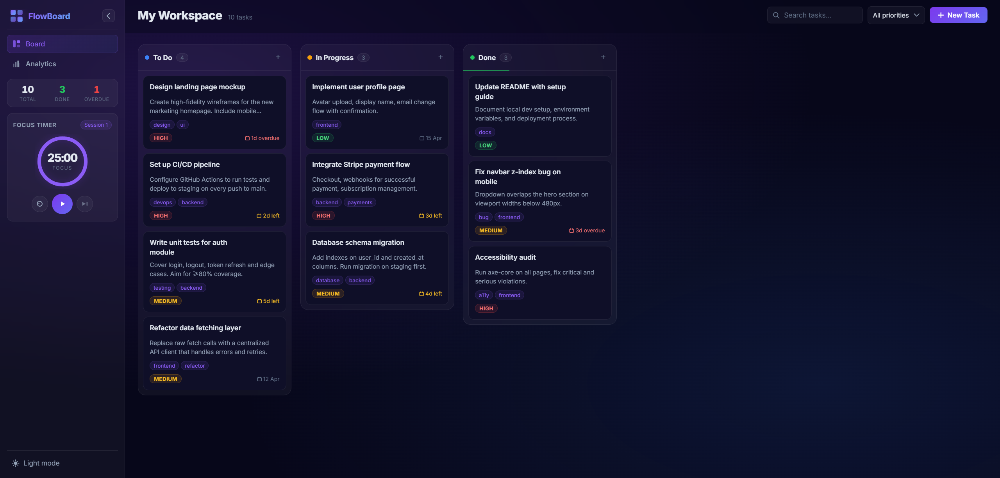

# FlowBoard

A fully client-side Kanban productivity app built with vanilla HTML, CSS, and JavaScript — no frameworks, no dependencies.

🌟 **[Live Demo](https://your-github-username.github.io/flowboard/)** 🌟



## Features

Kanban Board : Three columns (To Do, In Progress, Done) with drag & drop reordering
Task Management : Create, edit, and delete tasks with title, description, priority, tags, and due date
Focus Timer : Built-in Pomodoro timer (25 min focus / 5 min break) with visual countdown ring
Analytics : Completion rate, priority breakdown, column distribution, and recently added tasks
Search & Filter : Real-time task search with optional priority filter
Persistent Storage : All data saved in `localStorage`, survives page refresh
Dark / Light Mode : Toggle anytime, preference is saved
Keyboard Shortcuts : `N` to open new task, `Esc` to close modals

## Tech Stack

HTML5 : Semantic markup, ARIA attributes, accessible forms
CSS3 : Custom properties, glassmorphism, CSS Grid & Flexbox, responsive layout, keyframe animations
JavaScript (ES6+) : OOP with constructor functions & prototypes, closures, event delegation, drag & drop API, `localStorage`, `RegExp`, array methods (`map`, `filter`, `reduce`, `find`, `sort`, `forEach`), `setInterval`, `Date`

## Run Locally

No build step required. Open `index.html` directly in any modern browser, or serve with any static file server:

```bash
npx serve .
# or
python -m http.server 8080
```

## Project Structure

```
flowboard/
├── index.html    # App shell, semantic HTML
├── style.css     # Design system and all component styles
├── storage.js    # localStorage read/write abstraction
├── utils.js      # Pure helper functions (id, dates, validation, debounce)
├── board.js      # Task and Board classes (OOP, prototype chain)
├── timer.js      # Pomodoro timer (closure-based state machine)
└── app.js        # Application bootstrap, rendering, event handling
```
